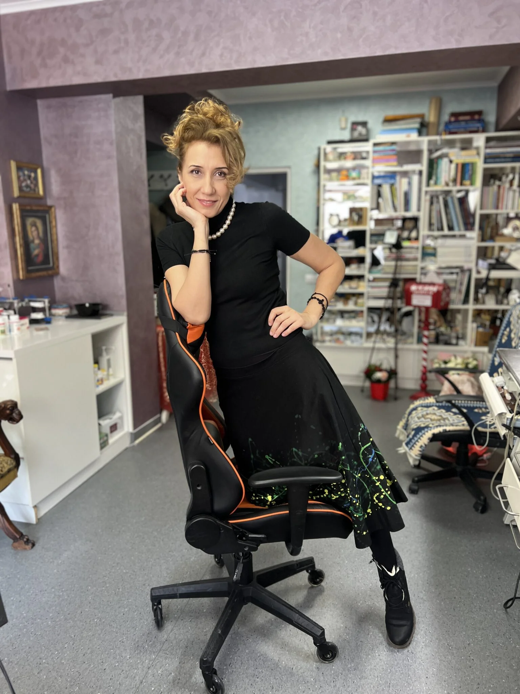
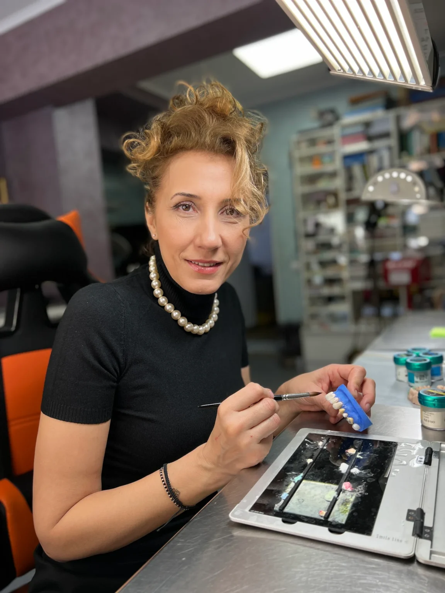
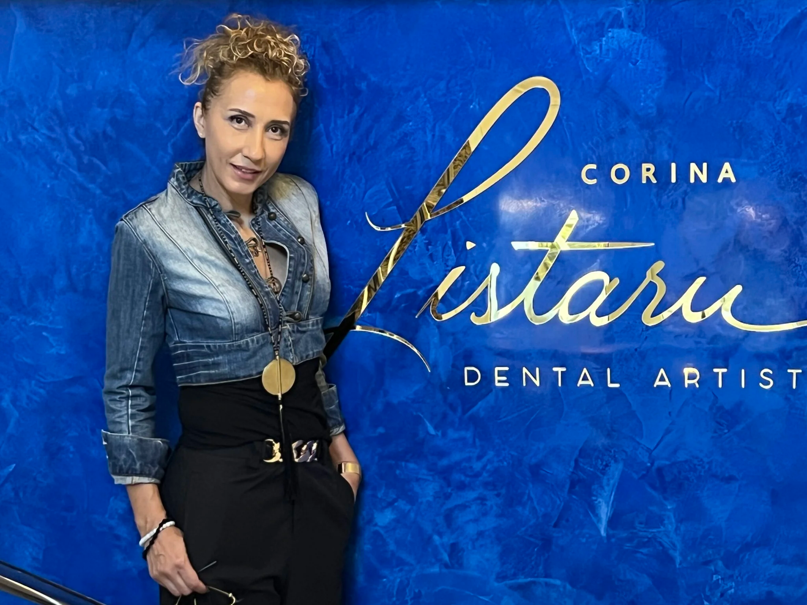
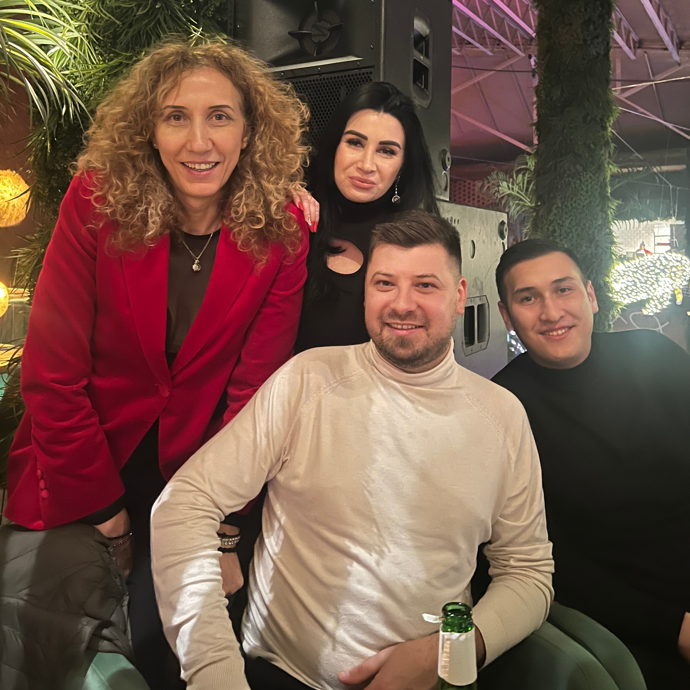
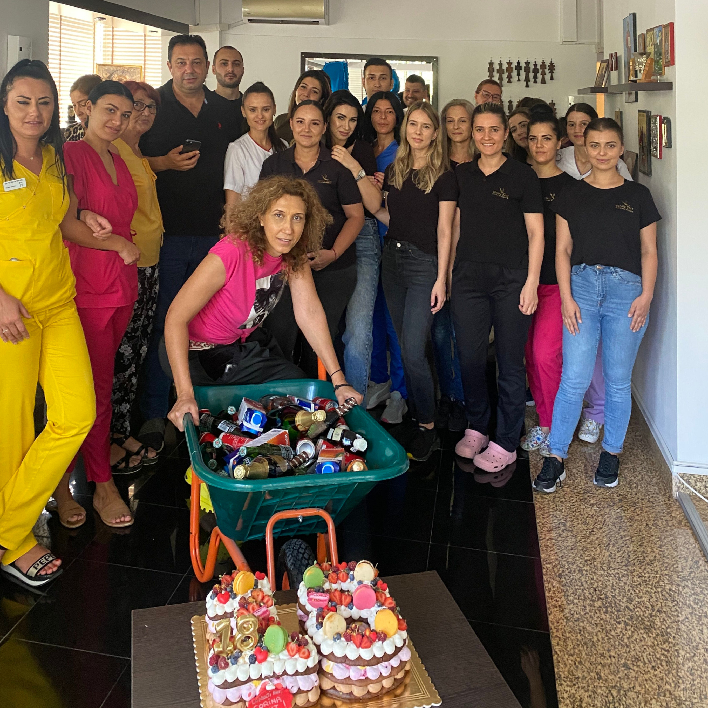
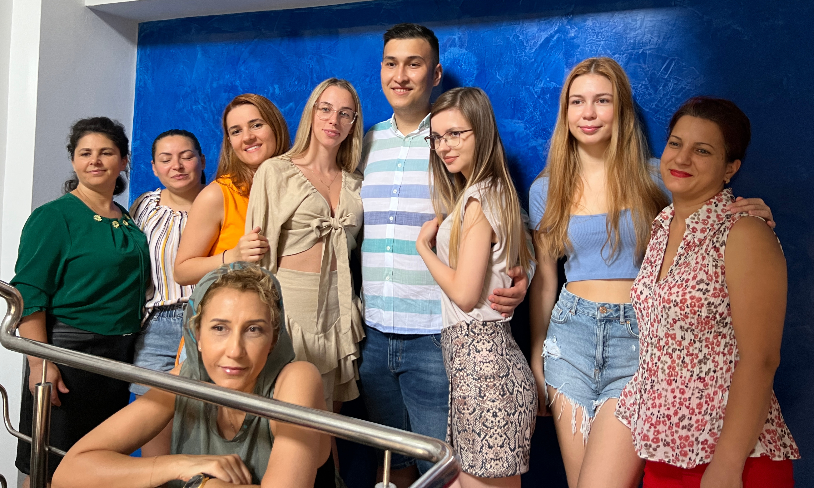
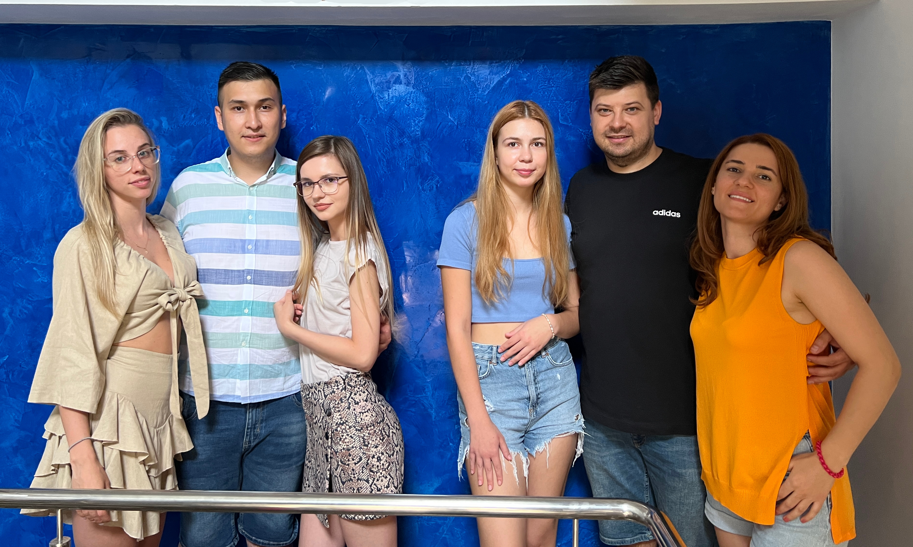

  

    

      <h2 class="black">Atelierul de Zâmbete</h2>
      <h3 class="gold">30 de ani de tehnică dentară in Constanța</h3>
      
&nbsp;

      

      Cu peste 30 de ani de experiență în domeniul tehnicii dentare, Atelierul de Zâmbete este locul în care excelența și inovația se împletesc pentru a oferi pacienților soluții dentare de cea mai înaltă calitate. Renumiți în Constanța pentru profesionalism și rezultate impecabile, ne mândrim cu faptul că fiecare lucrare care iese din laboratorul nostru este realizată cu precizie și dedicare maximă.	
      

      

      Laboratorul nostru este dotat cu echipamente de ultimă generație, ceea ce ne permite să abordăm fiecare caz cu tehnologie modernă și eficiență crescută. Colaborăm strâns cu medicii stomatologi pentru a ne asigura că fiecare pacient primește un tratament personalizat, menit să îmbunătățească atât funcționalitatea, cât și estetica zâmbetului.	
      

      

      În Atelierul nostru de Zâmbete, punem accent pe inovație, dar și pe tradiția profesionalismului, fiind dedicați să transformăm fiecare zâmbet într-o capodoperă. Aici, fiecare lucrare devine o expresie a pasiunii noastre pentru perfecțiune și a dorinței de a oferi pacienților zâmbete sănătoase și de durată.	
      

    

    

      
    

  

  

      

      Laboratorul nostru este dotat cu echipamente de ultimă generație, ceea ce ne permite să abordăm fiecare caz cu tehnologie modernă și eficiență crescută. Colaborăm strâns cu medicii stomatologi pentru a ne asigura că fiecare pacient primește un tratament personalizat, menit să îmbunătățească atât funcționalitatea, cât și estetica zâmbetului.	
      

      

      În Atelierul nostru de Zâmbete, punem accent pe inovație, dar și pe tradiția profesionalismului, fiind dedicați să transformăm fiecare zâmbet într-o capodoperă. Aici, fiecare lucrare devine o expresie a pasiunii noastre pentru perfecțiune și a dorinței de a oferi pacienților zâmbete sănătoase și de durată.	
      

  

  

   <h2>
    Originalitate •  
    Ambiție •  
    Viteză•  
    Adaptabilitate • 
    Respect pentru client • 
    Educație • 
    Comunicare•  
    Calitate
    </h2>
  

  
&nbsp;

  

    

      
    

    

      
&nbsp;

      <h2 class="black">Corina Listaru</h2>
      <h3 class="gold">Fondator Atelier de Zâmbete 
      Expert în tehnica dentară</h3>

      

      În Atelierul nostru de Zâmbete, punem accent pe inovație, dar și pe tradiția profesionalismului, fiind dedicați să transformăm fiecare zâmbet într-o capodoperă. Aici, fiecare lucrare devine o expresie a pasiunii noastre pentru perfecțiune și a dorinței de a oferi pacienților zâmbete sănătoase și de durată.	
      

    

  

  

    

      <h2 class="text-center">Echipa noastră</h2>
      

      Echipa Atelier de Zâmbete este formată din tehnicieni dentari cu o experiență vastă și o pasiune comună pentru perfecțiune. Fiecare membru al echipei noastre este dedicat să livreze lucrări de calitate superioară, punând accent pe detalii și inovație. De la simplu la complex, tratăm fiecare caz cu profesionalism și grijă, lucrând împreună pentru a oferi pacienților noștri cele mai bune soluții. Împreună, contribuim la crearea unor zâmbete de care pacienții noștri să fie mândri, oferind lucrări estetice și funcționale care depășesc așteptările.	
      

    

    

    &nbsp;
    

  

  

    
  

  

    
    
  

  

    
    
  

